---
title: Before the rise of um
author: Tim Gadanidis and Derek Denis

figPrefix:

    - "Figure"
    - "Figures"

tblPrefix:
    - "Table"
    - "Tables"

secPrefix:
    - "Section"
    - "Sections"

...

# Introduction

One of the most dramatic discourse-pragmatic changes in twentieth-century
English has progressed under the radar of laypeople and (until recently)
linguists: the rise of *um* as the predominant variant of the 'filled pause'
variable (UHM) at the expense of *uh* [@tottie2011; @fruehwald2016;
@wielingetal2016]. The variation is exemplified in (@first):

(@first) **Uh** as a rule they harrowed it before they **um** drilled it.
(NIA-22)

@fruehwald2016 [43] documents this "textbook" change over 100+ years of apparent
time: *um* increases incrementally between generations and the rise is led by
women. Why *um*? Why did this change occur? In this chapter, we investigate
(UHM) at an early stage of change to determine what triggered the rise of *um*.
We take up the hypothesis that the rise of *um* was connected to the development
of a new discourse function for the variable (UHM), that *um* came to be
favoured with. We remain agnostic about what the function is, but follow
@tottie2016 and @fruehwald2016 who suggest a correlation between utterance
position and function; and specifically @fruehwald2016[: 46], who suggests that
"turn-initial *um* may be the best candidate for a new discourse function coming
into use." We follow essentially a variationist approach, first treating *um*
and *uh* as variants of a linguistic variable and using proportional analysis to
assess the role of social and linguistic factors. We augment these results with
a different quantitative perspective and examine the relative frequency of the
variable itself in discourse to help in our interpretation. What we find is a
need to look beyond the envelope of variation, as defined, to understand the
results that we see.

# (UHM) as a pragmatic marker

The exact nature of (UHM) as a linguistic feature is not a trivial question. A
great deal of ink has been spilled over whether they are produced consciously or
unconsciously, and what their purpose is. One common view in the
psycholinguistics literature is that (UHM) is an involuntary noise uttered as a
result of production problems. For example, according to @levelt1989, "[*uh*]
apparently signals that at the moment when trouble is detected, the source of
the trouble is still actual or quite recent. But otherwise, [*uh*] doesn't seem
to mean anything. It is a symptom, not a sign" [@levelt1989 484].

One problem with the involuntary "symptom" view is that, as @clarkfoxtree2002
point out, speakers have some control over whether or not they produce
(UHM)---for example, it can be suppressed in a public speaking context (and
indeed, speakers are often counselled to do so). Based on data from corpora of
spontaneous speech, they argue that (UHM) is an "interjection" used to signify a
delay, with *um* signalling longer delays than *uh*. This view of (UHM) as an
ordinary word, which is planned and produced like any other, is broadly similar
to a seminal analysis by @maclayosgood1959[: 41--42] that characterizes (UHM) as
a floor-management device which speakers insert to indicate that they do not
want to be interrupted when hesitating over what to say.

Extending this line of analysis, @tottie2016 has put forward the argument that
(UHM) is a pragmatic marker that, in speech, indicates planning. This is on the
basis that (UHM) is used more frequently in contexts requiring more speaker
planning, such as narratives and responses to questions.  @tottie2017 describes
(UHM) as being on a "cline of lexicalization", where forms like *and-uh* and
*but-uh* are not perceived as words, but *uh* and *um* alone are. @tottie2017[:
21--22] describes the former case, where the final consonant of a monosyllabic
word such as *and* or *but* is immediately followed by (UHM), as cliticized
forms. She goes on to argue that the use of (UHM) between words and silent
pauses, rather than in these cliticized forms, causes (UHM) to be perceived as a
word in the lexicon, making it available for conscious use in writing. Along the
same lines, @gadanidis2018c argues that (UHM) is consciously, agentively used in
instant messaging, an interactive, text-based medium. On this hypothesis, (UHM)
has transitioned from a purely interactional feature (indicating that a pause is
incoming due to planning) to an interpersonal feature that indicate the
speaker's stance or point of view. For example, in (@opera), from
@tottie2017[: (2)], the writer plays on the word-search-indicating function of
*uh* to draw attention to their pun:

(@opera) An ode to opera's, **uh, operation**. As ... Baroque-era composers
become increasingly popular, more people wonder about the castrati --- the
emasculated singers ... (*L.A. Times* 2005)

If this process was a factor in (UHM)'s diachronic development, we might
expect to see an effect of cliticization at early stages, with the variant
that is more advanced in this functional change being used more outside of
cliticized forms like *and-uh*.

As we note above, the rise of *um* has now been described extensively in the
variationist and corpus-linguistic literature, across a number of corpora and
speech communities. The typical finding is that women have a higher *um*--*uh*
ratio than men, and that younger speakers have a higher *um*--*uh* ratio than
older ones. This pattern has been demonstrated in various speech communities and
contexts in the United States [@acton2011; @fruehwald2016; @wielingetal2016;
@lasernaetal2014], as well as in England and Scotland [@tottie2011;
@wielingetal2016], both in real and apparent time. In other words, we see a
pattern consistent with a classic sociolinguistic change---it is led by women,
and increasing over time and through generations---and this pattern is
replicated through multiple studies and multiple regions. Moreover,
@wielingetal2016 show that the pattern extends cross-linguistically as well,
showing that it exists not only in English but in five other Germanic languages:
Dutch, German, Norwegian, Danish, and Faroese.

While these accounts demonstrate definitively that a change is underway, an
explanation remains elusive. What was the trigger for this "textbook" change?
@fruehwald2016 and @wielingetal2016 both suggest that a new meaning or function
for *um* may have emerged in English[^1]. While neither study is explicit about
what such a function might be, some evidence adduced in support of this idea are
the findings that *um* "tended to have a longer duration, was preceded and
followed by longer pauses, and was more frequently found at the beginning or end
of an utterance than *uh*" [@wielingetal2016: 228]. @wielingetal2016 also
suggest that *um*'s rise may be related to a possible increase in its frequency
of use as a discourse marker (to manage turn-taking or to signal speaker
stance), which was not taken into account in their analysis.

Although @fruehwald2016 notes that *um* and *uh* appear to be trading
frequencies, casting doubt on a functional expansion explanation, it is possible
that the emergence of a new function at some earlier point may have played a
role nearer to the beginning of the change.  Accordingly, in this chapter, we
investigate data from before the rise of *um* with the goal of evaluating the
functional expansion hypothesis.

[^1]: For @wielingetal2016, this is a possible explanation for the
    crosslinguistic nature of the change: a function could have emerged
    in English and then spread through contact to the other Germanic
    languages.

# Data and coding

The data for this study are from the *Farm Work and Farm Life Since 1890* oral
history collection [@denis2016]. The corpus consists of oral history interviews
with 155 elderly farmers, recorded in 1984. The corpus covers five regions of
Ontario, Canada: Temiskaming, Essex, Dufferin, Niagara Region, and Eastern
Ontario; for this study, speakers from the latter two regions were considered.
Speaker birth years range from 1891 to 1919, just before *um* began to take off
per @fruehwald2016.

The interviews in each region were conducted by university students local to the
region: F-INT conducted the interviews in Niagara, and M-INT conducted the
interviews in Eastern Ontario.

For the purposes of this study, we follow @fruehwald2016, @wielingetal2016, and
@tottie2016, among others, in treating *uh* [ə] and *um* [əm] (also written as
*er* and *erm*) as variants of one sociolinguistic variable, termed (UHM). It
should be noted that this is not the only way that the variable context could be
defined. For instance, @tottie2018 includes (UHM) as one element of a set
including *well*, *you know*, and *like*, on the basis that all of the elements
are used to indicate speech planning. In principle, *unfilled* pauses, i.e.,
silence, could also be included in the variable context, and we will return to
this below. However, we argue that treating *um* and *uh* as an individual
variable captures the two words' intuitive and structural similarity[^2], both
variants being phonologically and orthographically identical, modulo the coda.
Both variants are also single-word constructions which, unlike *well*, *you
know*, and *like*, do not appear to be derived from bleached lexical items, but
from apparently non-lexical speech sounds. As @fruehwald2016 notes, they have
also traditionally been treated as a unique phenomenon in the psycholinguistic
literature.

[^2]: This is an (in our view justified) extension of the notion of
    "structural equivalence" [@pichler2010; @tagliamontedenis2010] to
    phonological/orthographic structure.

We extracted each instance of *uh* and *um* from the transcripts, excluding
unrelated instances such as *uh-oh*. Tokens from the two much-younger
interviewers were also extracted, and analyzed separately.  The transcription
protocol emphasized faithful reproduction of *uh* and *um*. All interviews were
carefully second-passed by the second author, knowing that (UHM) was of
potential analytical interest.

The data were coded for the following social factors: year of birth, gender, and
region (Niagara or Eastern Ontario). Year of birth and gender were used to
operationalize the change-in-progress hypothesis.  @tbl:speakers presents a
table of speakers by gender, region, and year of birth.

  --------- -------- ----------------- ----------------
  ID        Gender   Region            Year of birth
  --------- -------- ----------------- ----------------
  F-INT     F        Niagara           mid-late 1960s

  M-INT     M        Eastern Ontario   mid-late 1960s

  NIA-1     M        Niagara           1906

  NIA-9     F        Niagara           1912

  NIA-11    M        Niagara           1917

  NIA-12    F        Niagara           1916

  NIA-20    F        Niagara           1911

  NIA-22    F        Niagara           1899

  NIA-23    M        Niagara           1898

  NIA-24    M        Niagara           1902

  NIA-27    M        Niagara           1911

  NIA-28    M        Niagara           1907

  NIA-32    F        Niagara           1904

  NIA-35    F        Niagara           1902

  NIA-36    F        Niagara           1903

  EON-001   M        Eastern Ontario   1891

  EON-004   F        Eastern Ontario   1907

  EON-006   M        Eastern Ontario   1905

  EON-012   M        Eastern Ontario   1910

  EON-013   F        Eastern Ontario   1914

  EON-014   F        Eastern Ontario   1899

  EON-016   M        Eastern Ontario   1912

  EON-019   M        Eastern Ontario   1904

  EON-020   F        Eastern Ontario   1906

  EON-022   F        Eastern Ontario   1915

  EON-024   M        Eastern Ontario   1898

  EON-028   F        Eastern Ontario   1919

  --------- -------- ----------------- ----------------

Table: List of speakers.
{#tbl:speakers}

We also coded for two linguistic factors. To operationalize the functional
expansion hypothesis, we coded for initial or non-initial utterance position.
(UHM) was defined as "initial" if it was the first element in an utterance, as
in (@initial), and "non-initial" if it was not the first element in an
utterance, as in (@noninitial). The exception was in the case of *and-* or
*but-* cliticization, where (UHM) was classed as "initial" if the containing
utterance began with *and-uh* or *but-uh*.

(@initial) **Um** spring time was a very busy time for everyone on the farm. (EON-28, F/1919)

(@noninitial) The birthdays we'd **uh**- we'd try to- we'd **uh** remember them.
(EON-001, F/1907)

To test for a potential effect of cliticization (per @tottie2017's suggestion
that this may have played a role in (UHM)'s lexicalization), we coded each token
as "clitic" if it occurred immediately following *and* or *but*, as in
(@clitic), and as "non-clitic" otherwise, as in (@nonclitic).

(@clitic) If it was in school time I couldn't go unless it was Saturday
**but-uh**, auction sales were usually on Saturday.  (NIA-09, F/1912)

(@nonclitic) **Um** do you know how old you were when you started?  (F-INT)

# Results

## Proportional frequency

@tbl:comparison shows how our data compare with previous communities analyzed.
The first block summarizes our data from Niagara and Eastern Ontario, as well as
F-INT and M-INT, the two younger interviewers. The second block summarizes
results from previous work on the Switchboard corpus [@switchboard], the Fisher
corpus [@fisher], the Philadelphia Neighborhood Corpus (PNC)
[@labovrosenfelder2011], and the British National Corpus (BNC) ([-@bnc]). The
numbers for all of these other corpora are drawn from @wielingetal2016. From
left to right, the columns provide the raw number of *uh* tokens, the raw number
of *um* tokens, the percentage of (UHM) tokens that were *um*, the mean
frequency of *uh* per 1000 words (averaged across speakers), the mean frequency
of *um* per 1000 words, and the mean frequency of (UHM) altogether per 1000
words.

  ------------- ------- ------- ------ ------------ ----------- ----------
                  Raw N   Raw N     %          Mean        Mean       Mean
  Community        *uh*    *um*   *um*   *uh* /1000   *um*/1000   UHM/1000

  ------------- ------- ------- ------ ------------ ----------- ----------
  Niagara          1864     357   16.1         21.3         4.1       25.4

  E. Ont.          1563     168    9.7         22.6         2.4       25.0

  F-INT             321     318   49.8         12.4        12.3       24.7

  M-INT             255      51   16.7         13.2         2.6       15.8

  Switchboard       ---     ---   28.3         22.1         7.5       29.6

  Fisher            ---     ---   64.1          6.8         9.9       16.7

  PNC               ---     ---   27.6         13.2         4.5       17.7

  BNC               ---     ---   46.1          4.5         4.3        8.8

  ------------- ------- ------- ------ ------------ ----------- ----------

Table: Cross-community comparison
{#tbl:comparison}

As can be seen in the table, *um* is less frequent in our farmer data compared
to the more recent corpora. The female interviewer uses it around half the time,
while the male interviewer's rate is comparable to the farmers'. The median of
number of (UHM) tokens per speaker is 140, with an interquartile range of 105.5.
Relative frequency of (UHM) taken as a whole is on par with other corpora, but
we are cautious about making such a comparison because each corpus was collected
and transcribed differently [for related discussion, see @pichler2010].

Looking at individual speakers' rates, we can see that all speakers use both
*uh* and *um*, but there is little patterning by age or gender.
[@fig:indivage; @fig:indivgender] illustrate this by presenting each speaker's
*um* rate, with the bars coloured by region and gender, respectively.
@fig:indivage confirms a slight skew toward increased *um* rate in Niagara, but
this is not driven by any one speaker.  @fig:indivgender confirms a slight skew
toward increased *um* rate among female speakers, which again is not driven by
any one speaker. The numbers at the top of each bar indicate the number of (UHM)
tokens for that speaker.

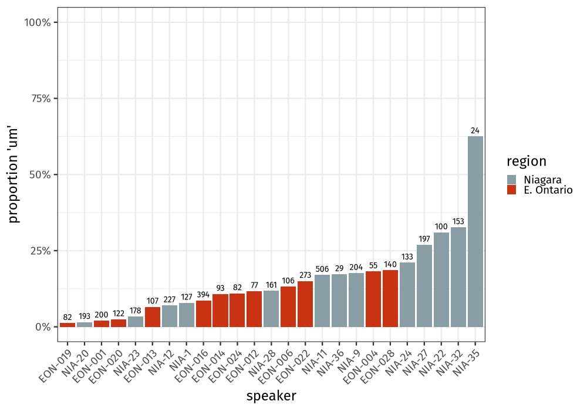{#fig:indivage width=12cm}

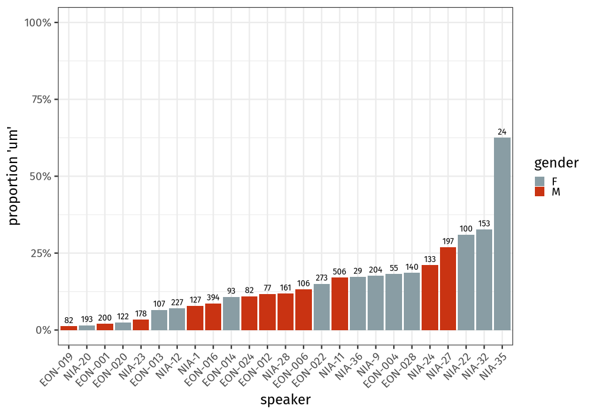{#fig:indivgender width=12cm}

@fig:apparenttime shows the proportion of *um* in apparent time, with year of
birth on the x-axis and *um* rate on the y-axis. Each point represents one
farmer (interviewers were excluded, other than where explicitly mentioned). In
the plot to the left, year of birth is binned into five-year increments, which
makes the patterns easier to see; in the plot to the right, year of birth is
continuous, and the line is drawn using R's LOESS (locally-estimated scatterplot
smoothing) function. Because LOESS is a local regression technique, the fit at a
given point is based on the data close to that point. The size of each point
indicates the number of tokens in that point (but note that the number of tokens
in each point was not taken into account by the LOESS fit). In both cases, there
is a modest trend upward over time. To determine the possible predictors
underlying this trend, in the following figures we split the data by gender,
position and cliticization. @fig:apparentgender shows the pattern when splitting
speakers by gender. Starting around 1905, women use *um* slightly less often
than men do, with both genders' *um* rates trending slightly upward over time.
@fig:apparentposition shows the pattern when splitting tokens by position
(initial vs. non-initial). Starting around 1905, *um* is used more frequently in
initial position than in non-initial position.  @fig:apparentclitic shows the
pattern when splitting tokens by cliticization with *and* or *but* and position.
*Um*'s proportional increase appears to be limited to non-cliticized initial
tokens.

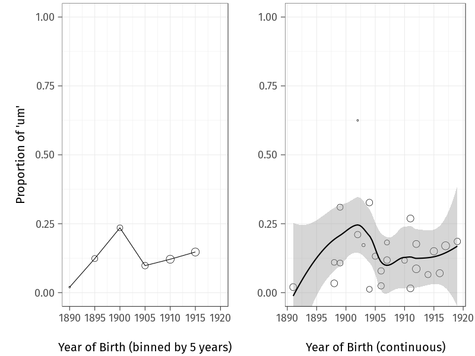{#fig:apparenttime width="0.8\\linewidth"}

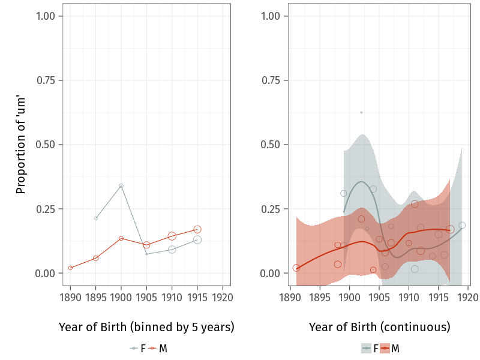{#fig:apparentgender width="0.8\\linewidth"}

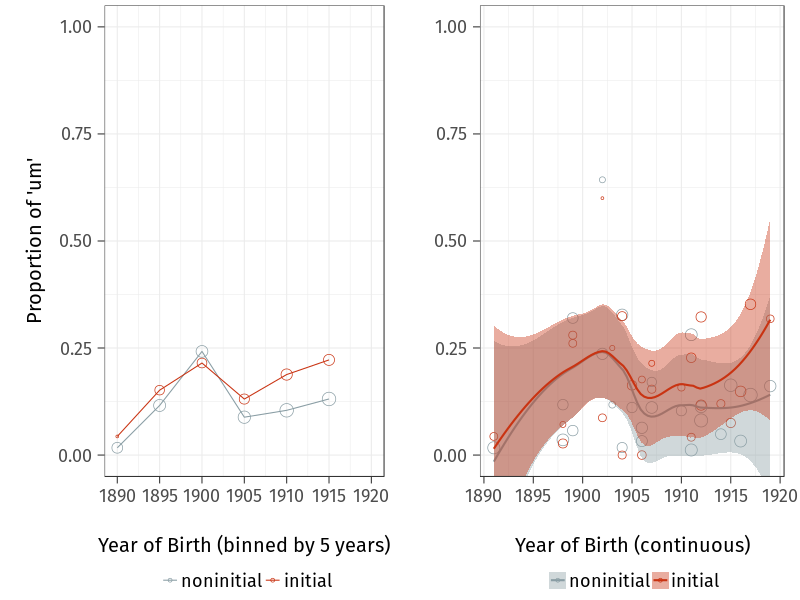{#fig:apparentposition width="0.8\\linewidth"}

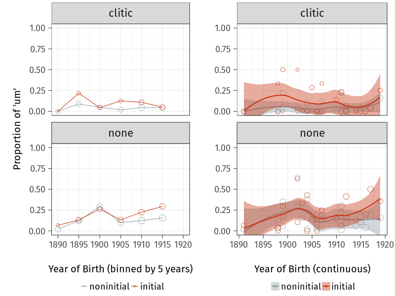{#fig:apparentclitic width="0.8\\linewidth"}

@fig:farmertree shows a conditional inference tree for all farmers. Conditional
inference trees are statistical models built by repeatedly splitting the data
based on a set of covariates, using a significance test procedure to select the
variables to split by [@tagliamontebaayen2012]. The model in @fig:farmertree
contained the predictors position ("pos"), cliticization ("clitic"), gender
(which was not selected for any splits), and year of birth. The model confirms
several of the patterns indicated in [@fig:apparenttime; @fig:apparentclitic].
The tree splits first at cliticization, with cliticized (UHM) having a low
overall *um* rate. Within the cliticized tokens, there is a slight difference
between noninitial and initial (UHM), with initial tokens having a higher *um*
rate (9.39%) than noninitial ones (4.35%). Within the noncliticized tokens,
there is an effect of year of birth: speakers born after 1898 have a much higher
*um* rate in noncliticized tokens than that of speakers born in 1898 or earlier
(4.65%). This is especially true in initial position: noninitial cliticized
tokens have a lower *um* rate (16.10%) than initial ones (21.90%).

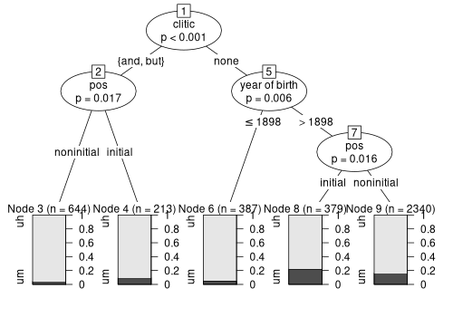{#fig:farmertree width="0.8\\linewidth"}

@fig:interviewertree shows a conditional inference tree for the two
interviewers. The model contained position and cliticization (the interviewers'
years of birth are not known, and there are only two speakers in any case). As
shown in the tree, the internal constraints are much the same, but the baseline
*um* rate is much higher (due in large part to the female interviewer). *Um* is
the least common in the cliticized forms (13.90%). In non-cliticized forms,
there is a split by position, where initial tokens favour *um* (53.20%) compared
to non-initial tokens (40.90%).

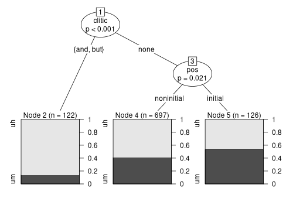{#fig:interviewertree width="0.8\\linewidth"}

Taken together, the results presented in this section appear to show the
beginning of the change toward *um* that has been observed by other
researchers. While other work has shown that women lead this change, we
do not find this pattern in our data. In fact, older woman actually use
(slightly) more *um* than do younger women. What we are likely seeing
here is a stage of change before gender specialization/split
[@labov2001social: 308], similar to quotative *be like* in earlier
generations [@tagliamontedarcy2007: 208--209].

Looking at internal factors, we can see that cliticized forms, like *and-uh*,
favour *uh*. There is some evidence for positional divergence, possibly
consistent with a new utterance-initial discourse function that favours *um*
[cf. @fruehwald2016, who found no turn-positional difference]. Conditional
inference trees confirm that the internal constraints persist with the younger
speakers, while their baseline *um* rate is higher. These patterns suggest that
in these early data, *um* may indeed be specializing to initial position,
potentially due to the emergence of a new utterance-initial discourse/pragmatic
function. In the following section, we test this hypothesis using relative
frequency data.

## Relative frequency

@fruehwald2016 tests the hypothesis that functional expansion triggered the rise
of um by considering changes to the relative frequency of variants over time
(e.g., frequency of *um* or *uh* per 1000 words).  When a new
discourse-pragmatic function emerges, we expect that these functions would add
to the relative frequency of the feature; it is being used overall more
frequently because it appears additionally in a new context. If the new function
is restricted to one variant, the relative frequency of that variant should
rise, with little change to the relative frequency of the other variant. In
other words, we expect a fishtail pattern as with the lexical frequency of
*computer* and *typewriter* over time: once *computer* gained its contemporary
meaning, its relative frequency took off as that meaning became more frequent.
This is illustrated in @fig:fishtail [Figure 3 from @fruehwald2016]: looking at
the proportion of *computer* over *typewriter* (left graph), *computer* appears
to replace *typewriter* over time; but looking at the relative frequency of each
word (right graph), it's clear that *typewriter* remained stable as *computer*
took off, being used in contexts that *typewriter* had never been used before.

![Proportional frequency and relative frequency of *computer* and *typewriter* [Figure 3 from @fruehwald2016]](figures/fishtail.png){#fig:fishtail width="0.8\\linewidth"}

If a new discourse function is what led to the rise of *um*, we should expect to
see a similar fishtail pattern, with *um* rising and *uh* remaining stable.
Conversely, if *um* were straightforwardly replacing *uh*, we should expect *uh*
to fall concurrently with *um*'s rise.

@fig:relfreq shows the frequency of *um* and *uh* per 1000 words for each of the
farmers, with year of birth on the x-axis and frequency on the y-axis.  Each
point represents one farmer. There is some evidence of a fishtail pattern, but
in the opposite direction as expected: *uh* is increasing as *um* remains
relatively stable. The pattern is more extreme when we split the data by
position, as in @fig:relfreqposition. In initial position, both *um* and *uh*
are largely stable, whereas in noninitial position, *uh* alone is increasing.
Splitting the data again by gender, we can see that the increase can be
attributed to the female speakers---there is no apparent increase over apparent
time for male speakers, but the older female speakers have a relatively lower
*uh* rate, rising to match the male speakers by the 1910s.

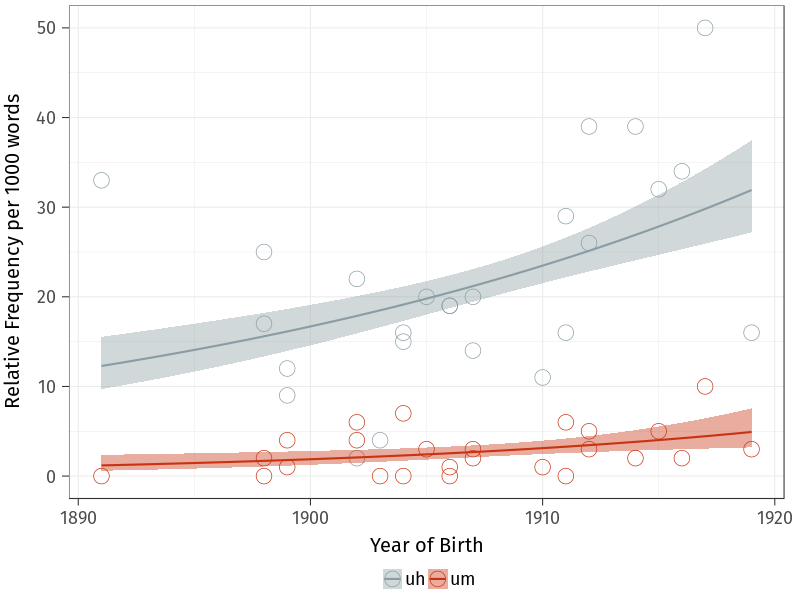{#fig:relfreq width="0.8\\linewidth"}

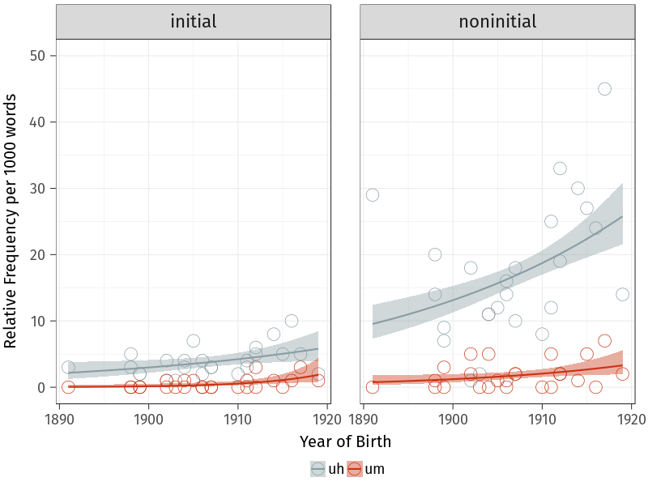{#fig:relfreqposition width="0.8\\linewidth"}

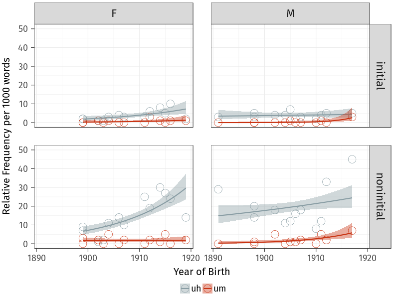{#fig:relfreqgenderposition width="0.8\\linewidth"}

We ran a mixed-effects Poisson regression model to confirm these interactions,
the results of which are shown in @tbl:poisson. The dataset fed to the model
included each speaker's *um* and *uh* counts in non-initial position, which was
the dependent variable; year of birth, gender, and variant (*uh* or *um*) were
the predictors, along with a random intercept for speaker and a random slope for
variant by speaker. The reference level for gender was male, and the reference
level for variant was *um*. Poisson regressions are well-suited for count data,
because the range of possible values is limited to zero and above, and the
assumption of normality is not required. Because our data are rates, not raw
count data, the logarithm of each speaker's word count was used as an offset in
order to normalize across speakers.

  ---------------------------------- ---------- ------------ --------- --------
  Predictor                            Estimate   Std. Error       *z*      *p*

  ---------------------------------- ---------- ------------ --------- --------
  (Intercept)                          -6.22331      0.24692   -25.204        0

  year of birth                         0.08301      0.03608     2.300   0.0214

  variant (*uh*)                        2.22094      0.27482     8.081        0

  gender (male)                        -0.23516      0.34576    -0.680   0.4964

  year of birth : variant              -0.07520      0.03987    -1.886   0.0593

  year of birth : gender               -0.06622      0.05106    -1.297   0.1946

  variant : gender                     -0.30181      0.38587    -0.782   0.4341

  year of birth : variant : gender      0.14482      0.05678     2.550   0.0108

  ---------------------------------- ---------- ------------ --------- --------

  Table: Mixed-effects Poisson regression model on non-initial (UHM) counts.
  {#tbl:poisson}

@tbl:poisson shows that there is an interaction between year of birth, variant,
and gender. The relevant coefficient, 0.14482, indicates that in non-initial
position, the slope for year of birth for *uh* is predicted to be greater for
men than for women. In other words, women's non-initial *uh* frequency (compared
to *um*) is increasing over time to a greater extent than men's is. This
confirms the fishtail pattern shown in the bottom-left and bottom-right facets
of @fig:relfreqgenderposition.

# Discussion

Exploring data from before the rise of *um* has not yielded a definitive
explanation for the change. Looking at the proportional frequency, we do find
that for the younger farmers, *um* appears more frequent than *uh* in initial
position, and the same is the case for the two (much younger) interviewers.
Alone, this could be taken as suggestive evidence in favour of a new,
initial-position function for *um*. Looking at the relative frequency, however,
we see that the pattern does not appear to be driven by an increase of *um* in
initial position--- like @fruehwald2016, we do not find strong evidence that a
new, utterance-initial function for *um* is behind the rise of *um*. The
question as to what the trigger for the rise of *um* was remains.  However, we
find evidence of a different change: *uh* seems to have expanded its functional
range in this time period. We tentatively suggest that this may be because *uh*
was recruited by speakers to fill erstwhile unfilled pauses, particularly in
non-initial position.

We illustrate this explanation using (@highuhm) and (@lowuhm): two
passages of about the same length from NIA-11, a younger woman in the dataset
(born 1917), and NIA-36, an older woman (born 1903). In the transcriptions,
(UHM) is bolded, and unfilled pauses are indicated using (.) or (...), depending
on the length of the pause. In her extract, NIA-11 uses (UHM) eight times--- all
but one of which are *uh*. In sharp contrast, NIA-36 does not use (UHM) once,
opting instead for lengthy, unfilled pauses. With respect to (UHM), the two
speakers employ fundamentally different discourse strategies.

(@highuhm) **INT**: And what types of fruit (.) did you grow?\
**NIA-11**: Well the **uh** (.) originally **uh** when they came- **uh** grandfather
bought the property in nineteen hundred and **uh** (.) **um** (.) to begin with
there was very- there were very few fruit trees on it and they planted (.)
**uh** (.) our orchard of **uh** (.) peaches. And **uh** waiting- while they
waited for the peaches to come into bearing, they planted raspberries between
the rows, so it started out as principally a raspberry farm I suppose but (.) it
evolved into a farm that **uh** principally grew peaches and cherries, mainly
sweet cherries.\
**INT**: Okay. And how much (.) older was the very oldest?\
**NIA-11**: The oldest was born (...) in eighteen ninety two (...) and then my sister
Lianne, eighteen ninety four (...) Greg, eighteen ninety eight (.) Sally
nineteen hundred and one (...) I was born nineteen hundred and three (.) and
that's it.

(@lowuhm) **INT**: Okay, and how old was your dad when you were born? At-\
**NIA-36**: (...) I- (...) how old was my dad when I was born? Oh.\
**INT**: I think we had figured out that he was probably somewhere around forty
five.\
**NIA-36**: Oh yes.\
**INT**: And your mom was?\
**NIA-36**: Thirty (.) five?\
**INT**: Thirty- oh-\
**NIA-36**: Is that it?\
**INT**: Yup. Good.

While our data are too early to shed much light on the rise of *um*, and it is
important to be careful when generalizing across corpora and speech communities,
it is possible that the *uh*-led shift from unfilled to filled pauses played a
role in the competition between *um* and *uh* in the years to come. For example,
if *uh* became specialized to non-initial position, which often appears to
indicate word-search [@tottie2016; @tottie2017], it may have become a less
desirable variant (frequent word-search potentially giving the impression of
disfluency). (@wordsearch) provides an example of this word-search usage from
@tottie2016:[^3]

(@wordsearch) Oh,
that one goes with --\
.. That's **um**=,\
...**u=m**\
.. $\langle$P God XXXXX P$\rangle$,\
... Isis and Osiris.

[^3]: In Tottie's transcription protocol, full stops indicate pauses,
    text between $\langle$P P$\rangle$ indicates soft (piano) voice, and
    Xs indicate incomprehensible speech.

This mid-utterance word-search function may previously have been linked with
unfilled pauses. Notice that in (@highuhm), (UHM) tends to appear when the
speaker is recalling information, such as what was planted (the family's
orchard) and what grew in the family's orchard (peaches) in the following
snippet: "they planted (.) **uh** (.) our orchard of **uh** (.) peaches". This
is the same sort of context in which lengthy unfilled pauses, marked by "(...)",
are used in (@lowuhm), when the speaker is recalling years of birth for her
family members. Our data thus provide tentative support for the idea that *uh*
may have become associated with this function, explaining its rise in overall
frequency among women in our data. However, we have to stress that more work
would be needed for us to be able to go beyond this kind of speculation.

# Conclusion

This study analyzed both proportional and relative frequency data, with the goal
of identifying potential triggers for the rise of *um* that has been described
over the last decade by @fruehwald2016, @tottie2016 and several others. Our
result highlights the importance of viewing discourse-pragmatic variation and
change from multiple angles: the two quantitative perspectives we employ here
provide complementary information about the functional expansion hypothesis.
Considering only the proportional data might suggest that a new function for
*um* is emerging, but the relative frequency data indicate that the relevant
change is actually one that we hadn't considered, and one that falls outside our
original envelope of variation: a change from unfilled pauses to *uh* in
non-initial position.
